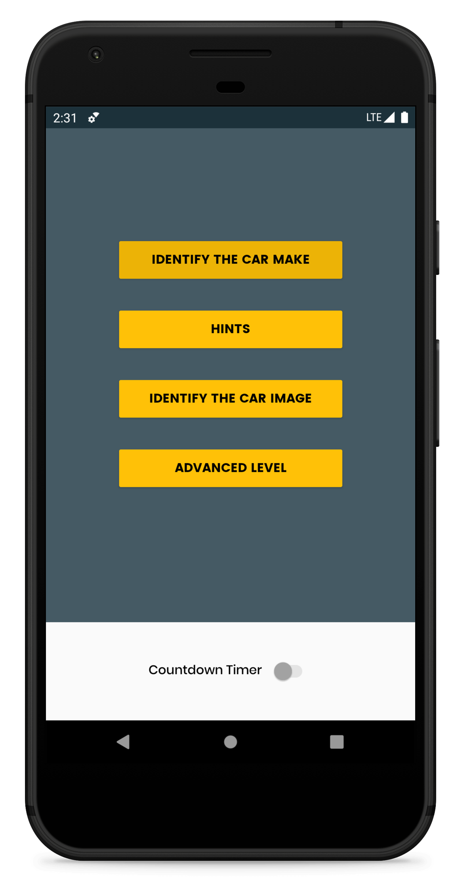
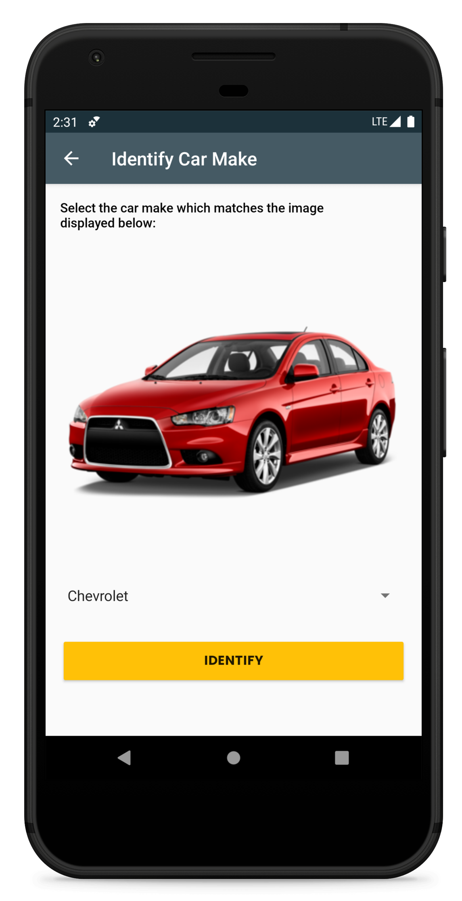
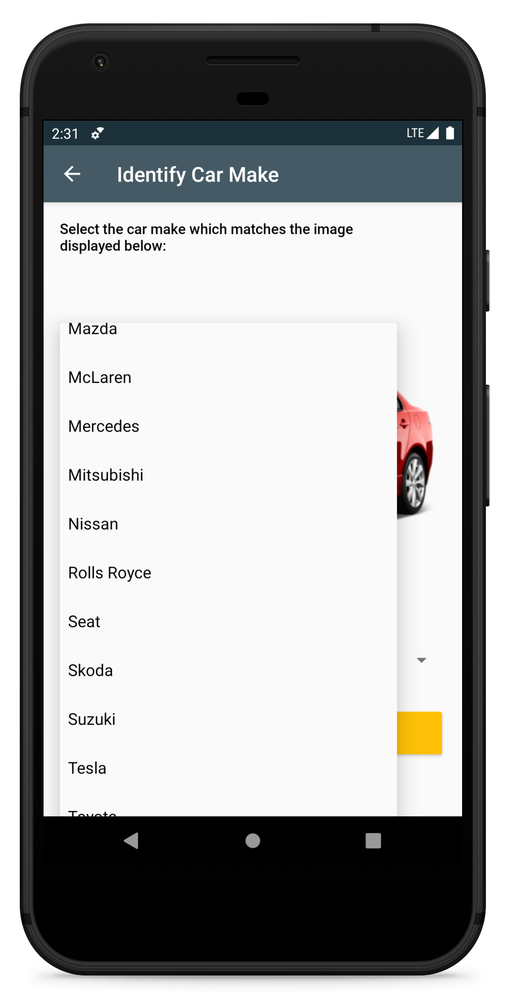
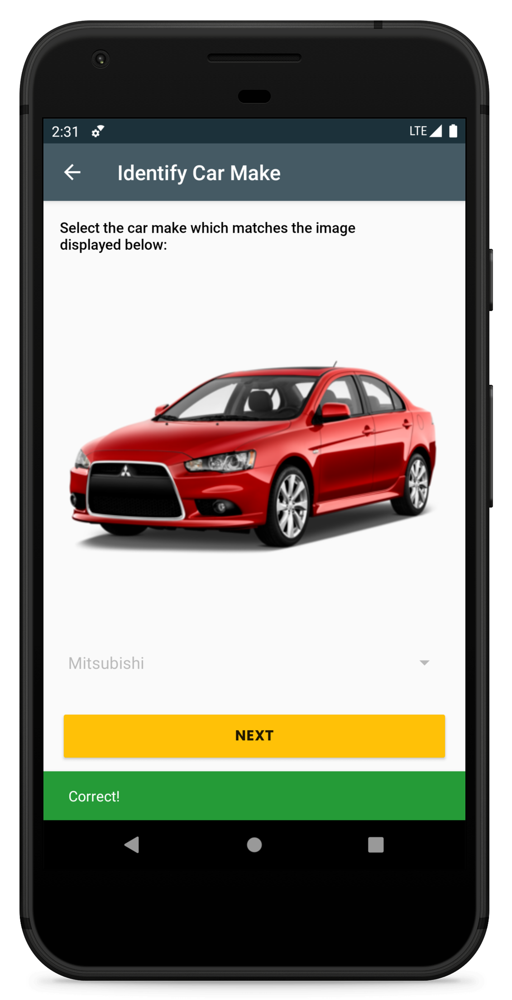
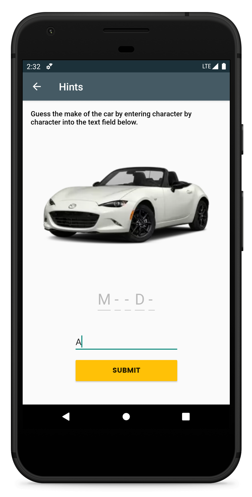
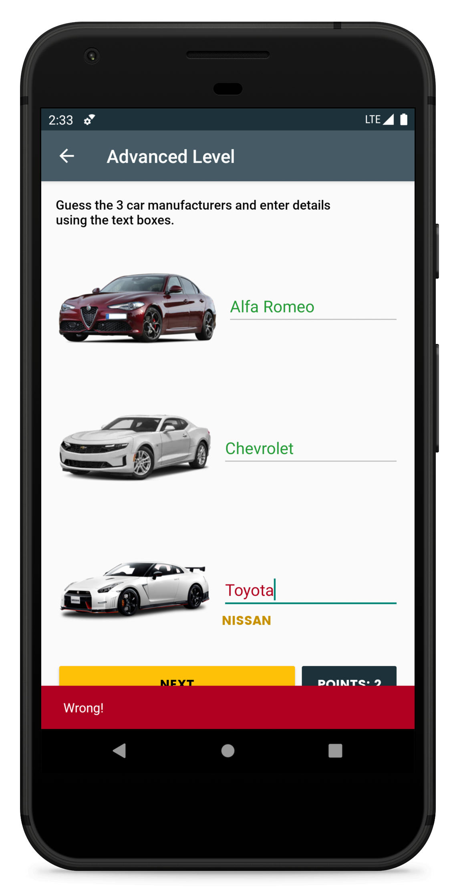
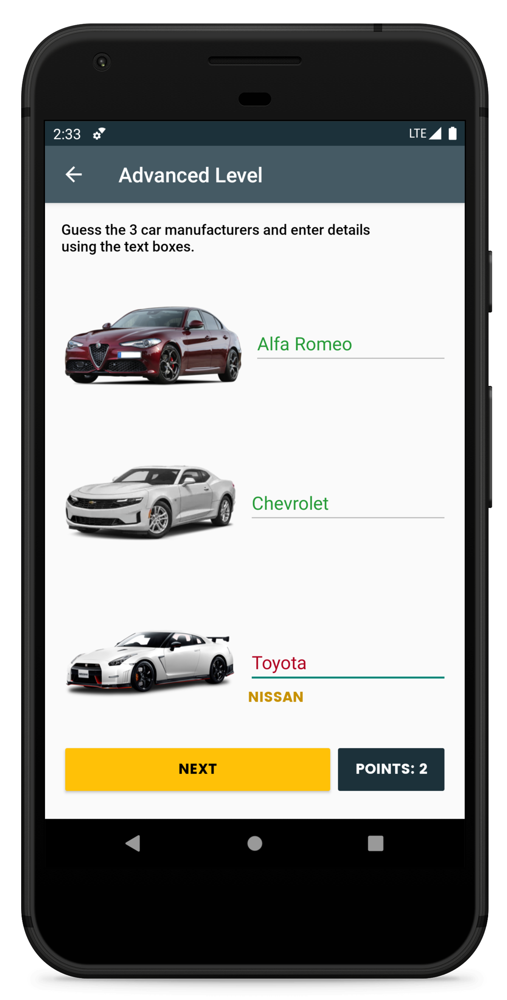

# MAD-CW01
This repo contains files for the project that was completed for **Coursework 01 of the Mobile Application Development** Module
in the 2nd year at IIT. The Application consists of several levels allowing the user to test their knowledge on identifying
different car makes and models. The levels are as below:
  1. **Identify Car Make**: The correct model should be selected from a dropdown
  2. **Hints**: The car make should be entered (a single character at a time)
  3. **Identify the Car Image**: The correct image according to the given make should be selected
  4. **Advanced Level**: Car make for 3 random images should be entered
  5. **Countdown Timer**: By activating, adds a timer to all levels

## Screenshots

  
   
  
   
  
  
  
  

